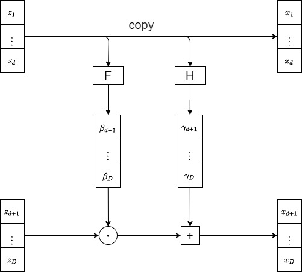
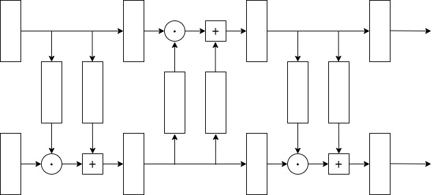

# Flow Model

## Basic Ideas

Suppose a neural network generator $G$ defines a distribution $P_G$, that is

$$
z\sim \pi(z), \,x\sim P_G(x),\\
x=G(z)
$$

The optimal model is 

$$
G^*=\underset{G}{\text{argmax}}\sum_{i=1}^m \text{log}P_G(x_i) \approx KL(P_{data}||P_G)
$$

From the transformation relationship, we have

$$
P_G(x_i)=\pi(z_i)|\text{det}(J_{G^{-1}})|
$$

where $\pi(z_i)=G^{-1}(x_i)$. Apply $\text{log}$ to both sides, we have

$$
\text{log}P_G(x_i)=\text{log}\pi(G^{-1}(x_i))+\text{log}|\text{det}(J_{G^{-1}})|
$$

The iteration of multiple models (the flow) is as follows

$$
\pi(x)\rightarrow\boxed{G_1}\rightarrow P_1(x)\rightarrow\boxed{G_2}\rightarrow P_2(x)\rightarrow \cdots
$$

And the we get distribution

$$
P_G(x_i)=\pi(z_i)|\text{det}(J_{G_1^{-1}})||\text{det}(J_{G_2^{-1}})|\cdots|\text{det}(J_{G_K^{-1}})|,\\
i.e.,\text{log}P_G(x_i)=\text{log}\pi(z_i)+\sum_{n=1}^K|\text{det}(J_{G_n^{-1}})|
$$

## Coupling Layer

It is easy to find that it is a invertible transformation, on the one hand,
$$
x_{i\leq d}=z_{i\leq d},\\
x_{i> d}=\beta_{i> d} z_{i> d}+\gamma_{i> d}
$$
on the other hand,
$$
z_{i\leq d}=x_{i\leq d},\\
z_{i> d}=\frac{x_{i> d}-\gamma_{i> d}}{\beta_{i> d}} 
$$

Now we can compute the Jacobian Matrix
$$
\left[
\begin{array}{c|c}
I& 0 \\ \hline 
*& Diagonal
\end{array}
\right]
$$
$$
\text{det}J_G=\frac{\partial x_{d+1}}{\partial z_{d+1}}\frac{\partial x_{d+2}}{\partial z_{d+2}}\cdots \frac{\partial x_{D}}{\partial z_{D}}=\beta_{d+1}\beta_{d+2}\cdots \beta_{D}
$$

### Coupling Layer Stacks

